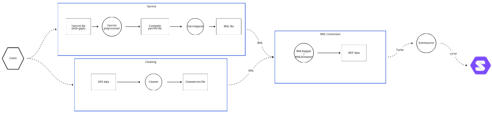

# Solid Event Sourcing

The goal of this repository is to help in transforming raw location data to RDF and storing it on a [Solid](https://solidproject.org/TR/protocol) pod.The location data is stored on the pod as an **Event Source**, as this allows other applications to build views based on their needs. 

Several key components used to achieve this goal:

* The **mapping** of gpx data to RDF is achieved using the RDF Mapping Language ([RML](https://rml.io/specs/rml/))
* The **ontology** used to encode the data is the Semantic Sensor Network Ontology ([SSN/SOSA](https://www.w3.org/TR/vocab-ssn/))
  * An example of a location measurement can be found [here](https://github.com/Sindhu-Vasireddy/LocationHistory/blob/main/vocab/examples/location_ssn.ttl)
* The **Event Source** used as data structure is Linked Data Event Streams ([LDES](https://w3id.org/ldes#))
  * To be more specific [LDES in LDP](https://woutslabbinck.github.io/LDESinLDP) is actually used. This it allows to use a CRUD model to append to the LDES with the use of the [LDP](http://www.w3.org/ns/ldp#) API
* To **persist the data** a Solid pod is used
  * More specific, the Community Solid Server ([CSS](https://github.com/CommunitySolidServer/CommunitySolidServer)) v5 is used as storage. *No guarantees can be made for other solid servers as those were not tested (yet)*

## Quick start

To save your gpx data to your solid pod, a pipeline was created that is executable with `script.py`. 
In this flow, we assume the Solid pod is local hosted at `http://localhost:3000/`.

Before running the script, some dependencies have to be installed first. This can be done using the following command:

```shell
sh ./install.sh
```

Next, we take our input gpx file (`example_run.gpx`) and store it to our Solid pod as an LDES in LDP. 

```shell
./script.py gpx -i example_run.gpx -l http://localhost:3000/lil/ -V http://example.org/location -u https://data.knows.idlab.ugent.be/person/woslabbi/#me -d http://device.be -ss http://sensor.be -t tm:Walking
```

In the script, subcommand `gpx` is used with following options:

* **-i**: The **input** file, which is required to follow the [gpx](https://wiki.openstreetmap.org/wiki/GPX) format.
* **-l**: The **location** of the LDES in LDP (i.e. an LDP Container, will be initialised when it does not exist yet).
* **-V**: The **Version Identifier** of your location.
* **-u**: The **WebId** of the **user** whose location it is.
* **-d**: The **device** used to capture the data points.
* **-ss**: The **sensor** used to do the measurements.
* **-t**: The **transport mode** used during the creation of the measurements.

More options can be found using the `-h` command (`./script.py gpx -h`).

### Setting up a local Solid pod

If you are new to Solid, you can use the following commands to set up your own local pod to test the flow.

````shell
cd CSS/
npx @solid/community-server -c "@css:config/file-no-setup.json" -f './data'
````

This command sets up a Solid pod without the set up with a file back-end.

It is also possible to set up a Solid pod with an in memory back-end for rapid prototyping:

```shell
npx @solid/community-server -c "memory-no-setup.json"
```


### Working with authentication

The code itself uses [@inrupt/solid-client-authn](https://github.com/inrupt/solid-client-authn-js) `Session` objects to deal with authenticated requests.

A small utility script  [`EventSource/loginCreds.ts`](EventSource/loginCreds.ts) is created to create credentials (stored in `config.json`) to be used in `script.py`. 

The following command allows you to run this utility script:


```sh
npx ts-node EventSource/loginCreds.ts -i http://localhost:3000
```

Where the -i parameter is the **IDP** used to authenticate your **WebID**. In this case, a CSS was local hosted.

## gpx to solid location history flow

Transforming raw gpx data to an Event Source in solid follows several steps:

First the gpx file is cleaned to allow this file to be processed. Next a custom RML file is being generated based on the input of the script. For this generation, the [yarrrml-parser](https://github.com/rmlio/yarrrml-parser) is used. 

Now, using this cleaned gpx and RML file, the actual mapping is executed, which is achieved using the [RML Mapper](https://github.com/RMLio/rmlmapper-java) (the mapper is already downloaded during the install script).

Finally, an Event Source is created using a [Naive](https://github.com/woutslabbinck/LocationMapper/blob/main/EventSource/src/algorithms/Naive.ts) algorithm on the solid pod. This Naive algorithm stores all the location data points as an LDES in LDP.

This whole process is visualised in the diagram below: (generated using [dataflow-visualisation](https://github.com/KNowledgeOnWebScale/dataflow-visualization))



## Developer information

The script has 5 subcommands in total which do the following:

| sub command | Description                                                  |
| ----------- | ------------------------------------------------------------ |
| gpx         | Transform a `gpx` file to RDF using RML and store it on a solid server using LDES in LDP |
| container   | Use a solid container with location data resources and store it as an LDES in LDP in another container |
| css         | Use an RDF file of location data and store it on a solid server (all in one container) |
| gpxToCss    | Transform a `gpx` file to RDF using RML and store it on a solid server (all in one container) |
| linestr     | Use an LDES using the location model and aggregate the location points to a wkt line string |

All these flows can also be executed manual without the use of the script. More information on how to run them can be found in the development [documentation](./documentation/README.md).

## Future work

Currently the only type of resources this pipeline works on is location data. Due to this, several parts of this pipeline are hard coded with the location data in mind.

Future work on this project will include extracting resources in the pipeline in a general way. This allows for creating an Event Source of any sort of data such as sensor time-series, financial transactions, ... .

## Feedback and questions

Do not hesitate to [report a bug](https://github.com/woslabbi/SolidEventSourcing/issues).

Further questions can also be asked to [Wout Slabbinck](mailto:wout.slabbinck@ugent.be) (developer and maintainer of this repository).