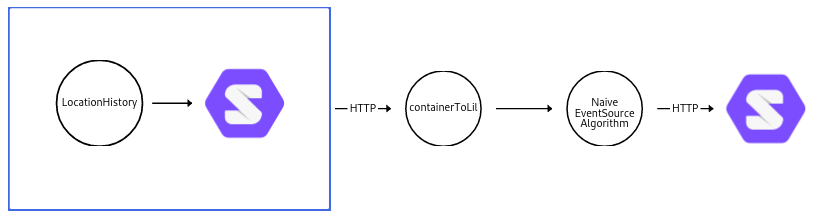

# Developer documentation

In this document, some additional information is given to run the other sub commands. Furthermore, a pointer on how to run a command manual is given for each sub command.

## gpx

Turn a gpx file into LDES in LDP resources on a solid pod. To accomplish this, some cli arguments are necessary.

```sh
./script.py gpx -i example_run.gpx -l http://localhost:3000/lil_test/ -V http://example.org/location -a 200 -u https://data.knows.idlab.ugent.be/person/woslabbi/#me -d http://device.be -ss http://sensor.be -t tm:Walking -au config.json
```

The assumptions for this example is that a solid server is local hosted at port 3000.

This example would take `data/Morning_Run.gpx` as input (`-i`) and `http://localhost:3000/lil_test` as output (`-l`).
The versionId would be `http://example.org/location` (`-V`), we would only look at the first 200 resources (`-a`), our personal url would be `https://data.knows.idlab.ugent.be/person/woslabbi/#me` (`-u`), the device that hosts the sensor is `http://device.be` (`-d`), our transport mode was `tm:walking` (`-t`) and our authentication credentials file is `config.json` (`-au`).

In [`info_gpx.md`](info_gpx.md), instructions can be found on how to execute this manually.
## container

Turn an LDP container of location data onto a pod into LDESinLDP resources.

The flow of what happens is described in the following diagram:


```sh
./script.py container -r http://localhost:3000/public/YourLocationHistory/Data/ -o http://localhost:3000/lil/ -V http://example.org/location -t http://www.w3.org/ns/sosa/resultTime -a config.json -l info
```

The assumptions for this example is that a solid server is local hosted at port 3000 and that the data was generated using the [Solid Location History](https://github.com/Sindhu-Vasireddy/LocationHistory) application.

This example would grab the container at `http://localhost:3000/public/YourLocationHistory/Data/` (`-r`), and would eventually place at `http://localhost:3000/lil_test/` (`-o`).
The versionId is `http://example.org/location` (`-V`), the timestamppath is `http://www.w3.org/ns/sosa/resultTime`, the authentication credentials file is `config.json` (`-a`), and the logging level is info (`-l`).

In  [`info_container.md`](info_container.md), instructions can be found on how to execute this manually.

## css

If you want to put data on your pod the way [LocationHistory](https://github.com/Sindhu-Vasireddy/LocationHistory) does it, then you can use this option (it is recommended to just use location history though).

```shell
./script.py css -i location.ttl -o http://localhost:3000/
```

In  [`info_css.md`](info_css.md), instructions can be found on how to execute this manually.

## gpxToCss

Turn a gpx file into a LDP container dump.

An example (the command is similar to the `gpx` subcommand, whereas the output is not):

```shell
./script.py gpxToCss -i example_run.gpx -u https://data.knows.idlab.ugent.be/person/woslabbi/#me -d http://device.be -ss http://sensor.be -t tm:Walking -o http://localhost:3000/short/ -V http://example.org/location
```

In  [`info_gpxToCss.md`](info_gpxToCss.md), instructions can be found on how to execute this manually.


## linestr

This sub command is used to retrieve a linestring of a versioned LDES with location data. It can be seen as a form of **aggregation**.

First, such an LDES has to be created. For this, the **yarrrml** file `RML/track_points_ldes.yaml` is used with several parameters filled in (more information on how to fill in the blanks is explained in [info_gpx](info_gpx.md)). 

We can create an `ldes.ttl` file when using this filled in yarrrml file together with a cleaned gpx file.

Then we can run the following example to actually create the [wkt](https://en.wikipedia.org/wiki/Well-known_text_representation_of_geometry) **LineString**, which will be printed out to the console.

```shell
./script.py linestr -i ldes.ttl
```

In  [`info_linestr.md`](info_linestr.md), instructions can be found on how to execute this manually.

